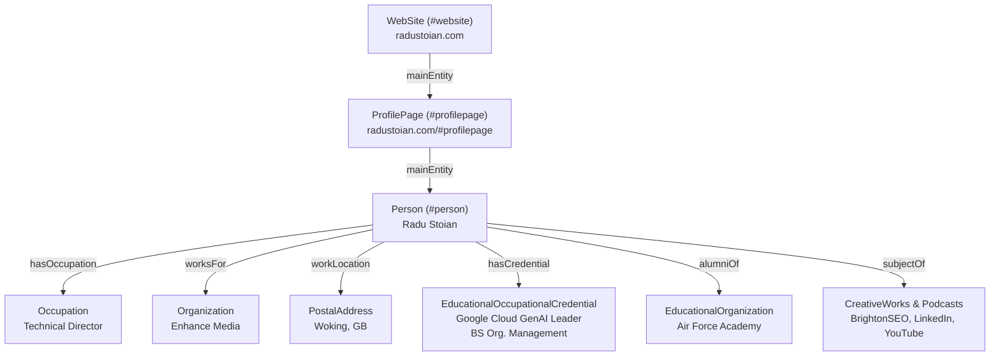
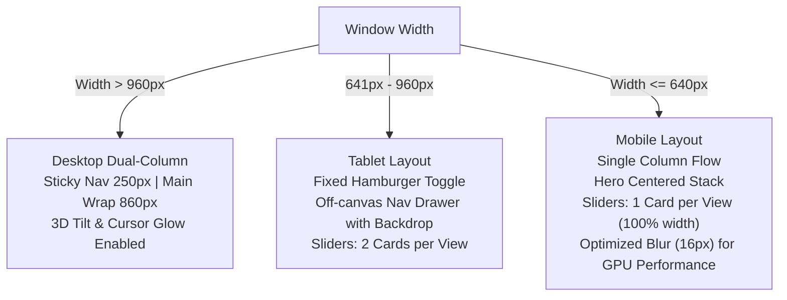

# Site Knowledge Base & Technical Architecture Documentation
**Repository:** [radustoian-em/radustoian-em](https://github.com/radustoian-em/radustoian-em)  
**Target Domain:** [https://radustoian.com](https://radustoian.com)  
**Site Owner:** Radu Stoian — Technical Director, Enhance Media  
**Last Updated:** September 2026

---

## Table of Contents

1. [Executive Summary & Site Purpose](#1-executive-summary--site-purpose)
2. [Repository Directory & File Architecture](#2-repository-directory--file-architecture)
3. [Deployment, Infrastructure & HTTP Headers](#3-deployment-infrastructure--http-headers)
   - [Cloudflare Pages & Workers Configuration (`wrangler.toml`)](#cloudflare-pages--workers-configuration-wranglertoml)
   - [HTTP Response & Security Headers (`_headers`)](#http-response--security-headers-_headers)
   - [Caching Architecture](#caching-architecture)
4. [AI Agent & LLM Ingestion Ecosystem](#4-ai-agent--llm-ingestion-ecosystem)
   - [AEO / GEO Philosophy](#aeo--geo-philosophy)
   - [`llms.txt` and `llms-full.txt` Specifications](#llmstxt-and-llms-fulltxt-specifications)
   - [Document Linking via `rel="describedby"`](#document-linking-via-reldescribedby)
   - [Open Job Context Protocol (OJCP) Context](#open-job-context-protocol-ojcp-context)
   - [WebMCP In-Browser Tool Suite (`js/webmcp.js`)](#webmcp-in-browser-tool-suite-jswebmcpjs)
   - [Model Context Protocol (MCP) Server (`https://radustoian.com/mcp`)](#model-context-protocol-mcp-server-httpsradustoiancommcp)
   - [Agent Skills Discovery Index (`/.well-known/agent-skills/index.json`)](#agent-skills-discovery-index-well-knownagent-skillsindexjson)
5. [Structured Data & Schema.org Specification](#5-structured-data--schemaorg-specification)
   - [JSON-LD Entity Graph Architecture](#json-ld-entity-graph-architecture)
   - [Entity Disambiguation & SameAs Profiles](#entity-disambiguation--sameas-profiles)
   - [Credentials, Occupations, and WorksFor](#credentials-occupations-and-worksfor)
   - [Publications, Masterclasses & Speaking Engagements](#publications-masterclasses--speaking-engagements)
   - [`metadata.json` vs. Inlined JSON-LD Sync](#metadatajson-vs-inlined-json-ld-sync)
6. [Design System & Styling Engine (`styles.css`)](#6-design-system--styling-engine-stylescss)
   - [Design Tokens (CSS Custom Properties)](#design-tokens-css-custom-properties)
   - [Typography System & Asynchronous Font Loading](#typography-system--asynchronous-font-loading)
   - [Liquid Glass & Neomorphic Bevel Aesthetics](#liquid-glass--neomorphic-bevel-aesthetics)
   - [Ambient Lighting & Atmospheric Orb Keyframes](#ambient-lighting--atmospheric-orb-keyframes)
   - [Responsive Layout & Mobile Breakpoints](#responsive-layout--mobile-breakpoints)
   - [Component Styling Details](#component-styling-details)
7. [JavaScript Animation & Interaction Engine (`script.js`)](#7-javascript-animation--interaction-engine-scriptjs)
   - [Performance & Accessibility Guardrails](#performance--accessibility-guardrails)
   - [Module 1: Global Image Fallback Handler](#module-1-global-image-fallback-handler)
   - [Module 2: Hardware-Accelerated Cursor Glow](#module-2-hardware-accelerated-cursor-glow)
   - [Module 3: 3D Interactive Card Tilt & Dynamic Sheen Tracker](#module-3-3d-interactive-card-tilt--dynamic-sheen-tracker)
   - [Module 4: Mobile Navigation Engine & Scroll Lock](#module-4-mobile-navigation-engine--scroll-lock)
   - [Module 5: High-Performance IntersectionObserver Active Nav Tracker](#module-5-high-performance-intersectionobserver-active-nav-tracker)
   - [Module 6: Responsive Multi-View Touch & Pointer Carousel Engine](#module-6-responsive-multi-view-touch--pointer-carousel-engine)
8. [SVG Sprite System & Asset Inventory](#8-svg-sprite-system--asset-inventory)
   - [SVG Symbol Library (`icons.svg`)](#svg-symbol-library-iconssvg)
   - [Image Assets & Optimization Matrix](#image-assets--optimization-matrix)
9. [Web Performance, Core Web Vitals & Accessibility (a11y)](#9-web-performance-core-web-vitals--accessibility-a11y)
   - [Largest Contentful Paint (LCP) Optimization](#largest-contentful-paint-lcp-optimization)
   - [Cumulative Layout Shift (CLS) Prevention](#cumulative-layout-shift-cls-prevention)
   - [Accessibility (a11y) & WCAG Compliance](#accessibility-a11y--wcag-compliance)
10. [Maintenance, Operations & Development Workflows](#10-maintenance-operations--development-workflows)

---

## 1. Executive Summary & Site Purpose

[radustoian.com](https://radustoian.com) serves as the primary professional digital footprint and authority hub for **Radu Stoian**, Technical Director at [Enhance Media](https://enhancemedia.co.uk/). 

### Core Value Proposition
> *"Transforming Talent Attraction by helping employers move from being **found** by search engines to being **recommended** by AI."*

The website demonstrates the practical execution of modern **Agentic AI Optimization (AIO)**, **Generative Engine Optimization (GEO)**, and **Technical Search Engine Optimization (SEO)** within recruitment marketing. Rather than relying on heavy client-side frameworks, the site is constructed using a high-performance, dependency-free vanilla web stack:
- Zero build tools or runtime dependencies (no Webpack, Vite, React, or Vue).
- Native semantic HTML5 with strict ARIA standards.
- Pure CSS3 utilizing CSS Custom Properties, multi-layered glassmorphic bevels, and hardware-accelerated animations.
- Lightweight vanilla JavaScript designed to eliminate layout thrashing and prevent reflows.
- Dual ingestion architecture designed symmetrically for human visitors and autonomous LLM agents (ChatGPT, Claude, Perplexity, Gemini, etc.).

---

## 2. Repository Directory & File Architecture

The repository is structured as a flat, highly performant static web application optimized for direct edge serving via Cloudflare Pages:

```
radustoian-em/
├── .git/                                 # Git version control metadata
├── .well-known/                          # Well-known standards and AI agent discovery manifests
│   ├── agent-card.json                   # A2A Protocol Agent Card manifest (agent-to-agent discovery)
│   ├── agent-skills/                     # Agent Skills Discovery RFC v0.2.0 directory
│   │   ├── index.json                    # Canonical skills discovery manifest ($schema + sha256 digests)
│   │   ├── mcp-server-tools/SKILL.md     # Remote Streamable HTTP MCP tools skill
│   │   ├── radu-stoian-profile/SKILL.md  # Profile and executive advisory skill
│   │   ├── talent-attraction-ai/SKILL.md # Talent attraction and AI brand health audit skill
│   │   └── webmcp-browser-tools/SKILL.md # In-browser WebMCP tool execution skill
│   ├── ai-catalog.json                   # Machine-readable ARD v0.91 catalog
│   ├── api-catalog                       # RFC 9264 linkset catalog
│   ├── ard.json                          # Agent Resource Discovery v0.91 manifest
│   └── mcp/
│       └── server-card.json              # MCP server card specification for WebMCP
├── _headers                             # Cloudflare Pages HTTP security and caching directives
├── agentic-architecture-mcp-llms.html    # Interactive Agentic AI discovery & execution architecture map
├── agentic-architecture-mcp-llms.md      # Pure ASCII Markdown representation of the architecture map
├── agentic-architecture-mcp-llms.md.txt  # Edge-served Markdown representation for AI agents
├── docs/
│   └── SITE_KNOWLEDGE_BASE.md           # This technical architecture knowledge base
├── icons.svg                            # 24-symbol external SVG sprite sheet
├── index.html                           # Main document with semantic markup & JSON-LD
├── index.md.txt                         # High-fidelity Markdown representation of homepage (.md.txt)
├── js/
│   ├── script.js                        # Modular, dependency-free JavaScript engine (412 lines)
│   └── webmcp.js                        # WebMCP in-browser AI agent tools (8 tools: navigation, carousels, case studies, testimonials, contacts, publications, speaking, skills)
├── llms.txt                             # Standardized summary file for LLMs & AI crawlers
├── llms-full.txt                        # Exhaustive context and biographical markdown for deep ingestion
├── metadata.json                        # Standalone JSON-LD Schema.org profile document
├── openapi.json                         # OpenAPI 3.1.0 specification for agent endpoints
├── README.md                            # GitHub profile page for @radustoian-em (DO NOT UPDATE)
├── robots.txt                           # Crawling directives and mandatory LLM notice pointing to llms.txt
├── script.js                            # Legacy root copy for backward compatibility (delete after 1 Dec 2026)
├── site.webmanifest                     # Progressive Web App (PWA) manifest
├── sitemap.xml                          # XML Sitemap with priority and change frequencies
├── styles.css                           # Complete design system & responsive styling (418 lines)
├── wrangler.toml                        # Cloudflare Workers / Pages configuration
│
└── [Raster & Vector Assets]
    ├── ai-employer-brand.png            # Article thumbnail (Employer Branding)
    ├── ai-optimisation.png              # Article thumbnail (AI Optimisation)
    ├── android-chrome-192x192.png       # PWA standard icon
    ├── android-chrome-512x512.png       # PWA high-resolution icon
    ├── apple-touch-icon.png             # iOS home screen touch icon
    ├── enhance-media-small-logo.png     # Legacy PNG fallback for cached clients (scheduled removal Nov 2026)
    ├── enhance-media-small-logo.webp    # Enhance Media corporate mark (36x36, rendered 24x24)
    ├── favicon-16x16.png                # Browser tab favicon 16px
    ├── favicon-32x32.png                # Browser tab favicon 32px
    ├── favicon.ico                      # Legacy multi-size icon
    ├── jlp-jobs-case-study1.webp        # John Lewis Partnership case study slide
    ├── jlp-smart-job-search-case-study.webp # JLP Smart Search case study slide
    ├── organic-first-approach.png       # Article thumbnail (TA Strategy)
    ├── radu-stoian-enhance-media.jpg    # Desktop hero portrait & OpenGraph image (640x732)
    ├── radu-stoian-enhance-media.webp   # Mobile responsive hero portrait (200x200)
    ├── university-of-surrey-case-study.jpg # University of Surrey case study slide
    └── virgin-atlantic-case-study.jpg   # Virgin Atlantic case study slide
```

---

## 3. Deployment, Infrastructure & HTTP Headers

### Cloudflare Pages & Workers Configuration (`wrangler.toml`)
The project is configured for seamless deployment on Cloudflare's global edge network via Wrangler:

```toml
name = "radustoian-em"
compatibility_date = "2026-09-26"

[assets]
directory = "."
```

- **`compatibility_date`**: Pins Cloudflare Workers runtime features to `2026-09-26`.
- **`[assets] directory = "."`**: Directs Cloudflare to serve the repository root as static assets without requiring a compile or transpile build step.

### HTTP Response & Security Headers (`_headers`)
Security and caching are configured at the edge via Cloudflare's `_headers` syntax:

```http
# Global Security Headers
/*
  X-Content-Type-Options: nosniff
  X-Frame-Options: SAMEORIGIN
  Referrer-Policy: strict-origin-when-cross-origin
  Permissions-Policy: camera=(), microphone=(), geolocation=()
```

#### Security Directives Explained:
1. **`X-Content-Type-Options: nosniff`**: Prevents MIME-type sniffing by browsers, forcing adherence to declared `Content-Type`.
2. **`X-Frame-Options: SAMEORIGIN`**: Mitigates clickjacking attacks by forbidding rendering in iframes outside the primary domain.
3. **`Referrer-Policy: strict-origin-when-cross-origin`**: Protects user privacy while preserving origin telemetry on same-protocol cross-origin navigations.
4. **`Permissions-Policy: camera=(), microphone=(), geolocation=()`**: Hardware isolation explicitly locking down device sensors.

### Caching Architecture

| Resource Pattern | Strategy | `Cache-Control` Value | Purpose |
| :--- | :--- | :--- | :--- |
| `/*.html`, `/` | Revalidate immediately | `public, max-age=0, must-revalidate` | Ensures new deployments are served immediately to visitors without stale HTML holding old hashes. |
| `*.jpg`, `*.jpeg`, `*.png`, `*.webp`, `*.svg`, `*.ico` | Long-term immutable | `public, max-age=31536000, immutable` | Static media cached in browser and edge caches for 1 full year (31,536,000s). |
| `/styles.css`, `/js/*` | Stale-while-revalidate | `public, max-age=86400, stale-while-revalidate=604800` | 24-hour fresh cache with a 7-day stale-while-revalidate window for instant repeat visits. |
| `/script.js` | Stale-while-revalidate | `public, max-age=86400, stale-while-revalidate=604800` | Legacy fallback copy for backward compatibility with cached clients. Scheduled for removal after 1st December 2026. |
| `/site.webmanifest`, `/llms.txt`, `/llms-full.txt`, `/metadata.json` | Stale-while-revalidate | `public, max-age=86400, stale-while-revalidate=604800` | High-availability specification files cached 1 day with 7 days background revalidation. |
| `/index.md.txt`, `/*.md.txt` | Stale-while-revalidate | `public, max-age=86400, stale-while-revalidate=604800` | Markdown representations for AI agents with `text/markdown` MIME type and `Vary: Accept`. |

---

## 4. AI Agent & LLM Ingestion Ecosystem

### AEO / GEO Philosophy
The site is built to bridge conventional search engine visibility with modern LLM recommendation engines (ChatGPT Search, Perplexity, Claude Artifacts, Google Gemini, and Google Search Generative Experience). Traditional SEO optimizes solely for crawler indexing; this architecture provides explicit context files formatted directly for token-efficient LLM ingestion.

### `llms.txt` and `llms-full.txt` Specifications

1. **[`llms.txt`](file:///home/radu/antigravity/radu/llms.txt)**:
   - Adheres to the emerging `/llms.txt` standard.
   - Contains high-level entity statements and points to canonical endpoints.
   - Designed for fast retrieval by agents operating under small token budgets.

2. **[`llms-full.txt`](file:///home/radu/antigravity/radu/llms-full.txt)**:
   - Exhaustive 9.2 KB plain text document formatted in Markdown.
   - Contains full professional biography, core expertise, client testimonials (John Lewis Partnership, Virgin Atlantic, Mott MacDonald, ActionHR, Eteach), list of verified public profiles, publications, case studies, speaking history, and credentials.
   - Allows AI agents to answer nuanced questions regarding Radu Stoian's track record without scraping and parsing DOM structures.

3. **[`index.md.txt`](file:///home/radu/antigravity/radu/index.md.txt)**:
   - Complete Markdown representation of the homepage for AI agents.
   - Follows Cloudflare's *Markdown for Agents* standard with YAML frontmatter metadata and concluding JSON-LD structured data block.
   - Consumes ~4,773 estimated tokens compared to ~10,588 tokens for the raw HTML (a 55%+ token reduction).

> [!NOTE]
> **Page Copy & AI Synchronization Invariant:** Whenever the homepage copy in `index.html` is updated, the `.md.txt` file (`index.md.txt` / `.md.txt`) and the contents of `llms-full.txt` must always be updated in parallel to maintain parity across AI ingestion layers.

### Markdown Content Negotiation (`Accept: text/markdown`)
The site supports HTTP content negotiation for autonomous agents via a dedicated Cloudflare Worker deployed in the Cloudflare dashboard and bound to `radustoian.com/*`:
- **Agents:** When a request includes the `Accept: text/markdown` header, the Cloudflare Worker intercepts the request and returns `index.md.txt` with `Content-Type: text/markdown; charset=utf-8`, `Vary: Accept`, `Cache-Control: private, no-cache, no-store, must-revalidate` (preventing edge cache collisions between HTML and Markdown representations), and token estimation headers (`x-markdown-tokens: 4774`, `x-original-tokens: 10588`).
- **Browsers:** Standard browser requests pass through to Cloudflare Pages static origin to receive semantic HTML with `Vary: Accept` and discovery Link header (`Link: </index.md.txt>; rel="alternate"; type="text/markdown"`).
- **Direct Route:** Accessible directly via `/index.md.txt` or `/.md.txt`.

### Document Linking via `rel="describedby"` and `rel="alternate"`
In [`index.html`](file:///home/radu/antigravity/radu/index.html), explicit machine-readable links inform AI agents and scrapers where to fetch semantic context without duplicate or conflicting declarations:

```html
<link rel="alternate" type="text/markdown" href="https://radustoian.com/index.md.txt" title="Markdown Version">
<link rel="describedby" type="text/markdown" href="https://radustoian.com/llms-full.txt">
<link rel="describedby" type="application/json" href="https://radustoian.com/metadata.json">
<link rel="ard" type="application/json" href="https://radustoian.com/.well-known/ard.json">
<link rel="ai-catalog" type="application/json" href="https://radustoian.com/.well-known/ai-catalog.json">
<link rel="api-catalog" type="application/linkset+json" href="https://radustoian.com/.well-known/api-catalog">
<link rel="mcp-server-card" type="application/json" href="https://radustoian.com/.well-known/mcp/server-card.json">
```

### Open Job Context Protocol (OJCP) Context
The profile highlights contributions to the **Open Job Context Protocol (OJCP)** (pull request #8: standardizing `url` and `official_job_url` schema fields). This connection directly impacts how Model Context Protocol (MCP) agents extract and verify corporate job postings without intermediate aggregator interference.

### WebMCP In-Browser Tool Suite (`js/webmcp.js`)
The site implements the emerging [WebMCP specification](https://webmachinelearning.github.io/webmcp/) via `document.modelContext.registerTool` (or `navigator.modelContext`), exposing native structured tools to AI-enabled browsers and autonomous web agents with `readOnlyHint: true` annotations:

| Tool Name | Title | Input Parameters | Description |
| :--- | :--- | :--- | :--- |
| `navigateToSection` | Go to page section | `section` (enum: `top`, `about`, `expertise`, `insights`, `projects`, `testimonials`, `speaking`, `skills`, `connect`) | Scrolls the page smoothly or instantly to a section and returns its heading and text content. |
| `showCarouselSlide` | Browse case studies or testimonials | `carousel` (`caseStudies` \| `testimonials`), `action` (`next` \| `previous` \| `goto`), `index` (optional 1-based integer) | Controls interactive multi-view carousels, awaiting CSS transitions before reporting visible cards and boundary states. |
| `listCaseStudies` | List client case studies | None (`{}`) | Returns all client case studies (John Lewis Partnership, University of Surrey, Virgin Atlantic, JLP Smart Careers) with titles, metric highlights, and case study links. |
| `listTestimonials` | List client testimonials | None (`{}`) | Returns all verified client testimonials (names, roles, companies, and complete quotes). |
| `getContactLinks` | Get contact & profile links | None (`{}`) | Extracts deduplicated social and profile links (LinkedIn, X, Substack, GitHub). |
| `listPublications` | List publications & Substack articles | `platform` (optional enum: `all`, `substack`, `linkedin`) | Extracts main publications (titles, topics, summaries, URLs) and specifically identifies all direct links to Radu's articles on Substack. |
| `listSpeakingEngagements` | List speaking & industry engagements | `format` (optional string filter) | Returns conference masterclasses (BrightonSEO), podcast appearances, expert panels, and open standards contributions (OJCP) with event links and media resources (YouTube, Speaker Deck, GitHub). |
| `listCertificatesAndSkills` | List certificates, skills & profile links | None (`{}`) | Returns professional certificates (Google Cloud GenAI Leader, Intro to GenAI, BigQuery), skill tags, and verified external profile links to all skills and certifications on LinkedIn and Google Skills. |

> [!NOTE]
> **CSS Styling & WebMCP Synchronization Invariant:** Following any CSS styling or layout modifications (e.g. changes to class names, DOM selectors, card structures, or carousel transition timings), verify whether the WebMCP tools in `js/webmcp.js` require corresponding updates. WebMCP tools rely directly on DOM element queries, class selectors (such as `.talk-item`, `.cert-item`, `.skill-tag`), and carousel transition events (`transitionend` on `#expTrack` and `#testTrack`).

### Model Context Protocol (MCP) Server (`https://radustoian.com/mcp`)
The site deploys a live **Model Context Protocol (MCP)** server on Cloudflare Workers, providing remote autonomous AI agents with structured JSON-RPC 2.0 access over Streamable HTTP (`POST https://radustoian.com/mcp`). Unlike client-side WebMCP, this server operates independently of web browsers and can be invoked directly by agentic frameworks, multi-agent systems, and IDE tools.

#### Key Architectural Characteristics
- **Transport:** Streamable HTTP (JSON responses, protocol version `2025-06-18`).
- **Dynamic Information Retrieval (IR):** Employs BM25 term weighting, stopword filtering, lightweight stemming, and synonym expansion to score every block of site content dynamically against incoming questions without hardcoded Q&A trees.
- **Hierarchical Knowledge Ingestion:** Evaluates content across `llms-full.txt` (primary), `index.md.txt` (secondary), `metadata.json` (Schema.org JSON-LD), and `index.html` (DOM fallback).
- **Fail-Safe Default Mechanism:** If a question cannot be answered with high confidence from a specific block, the server automatically provides the **entire content of `llms-full.txt`** as a fail-safe default answer along with 29 verified external investigation links so the agent always receives full context.

#### Available MCP Tools
| Tool Name | Parameters | Description |
| :--- | :--- | :--- |
| `ask-question` | `question` (string, required) | Dynamically retrieves the most relevant block and section for any question about Radu Stoian, with fail-safe fallback to complete `llms-full.txt`. |
| `get-section` | `section` (string, required) | Returns the raw text, parsed block array, and links of any specific section in `llms-full.txt`. |
| `get-investigation-links` | None (`{}`) | Returns 29 external public profile, publication, and certification links for off-site agent exploration. |
| `server-info` | None (`{}`) | Returns server version, runtime environment, protocol version, and knowledge source URLs. |

### Agent Skills Discovery Index (`/.well-known/agent-skills/index.json`)
The site adheres to the [Agent Skills Discovery RFC v0.2.0](https://github.com/cloudflare/agent-skills-discovery-rfc) sponsored by Cloudflare, Anthropic, and AgentSkills.io. It publishes a machine-readable discovery manifest at `/.well-known/agent-skills/index.json` pointing to single-file skill documents (`type: "skill-md"`), each accompanied by cryptographic SHA-256 integrity digests:

```json
{
  "$schema": "https://schemas.agentskills.io/discovery/0.2.0/schema.json",
  "skills": [
    {
      "name": "mcp-server-tools",
      "type": "skill-md",
      "description": "Instructions for autonomous AI agents to connect to the live JSON-RPC 2.0 Streamable HTTP MCP server at radustoian.com/mcp for dynamic question answering, section retrieval, and fail-safe retrieval.",
      "url": "/.well-known/agent-skills/mcp-server-tools/SKILL.md",
      "digest": "sha256:37104b6300097a8ca2b2123afd65d4851a4f70723b2cf6971c560b82e09ac085"
    },
    {
      "name": "radu-stoian-profile",
      "type": "skill-md",
      "description": "Retrieve and evaluate Radu Stoian's professional background, case studies, publications, and executive advisory in Agentic AI and recruitment marketing.",
      "url": "/.well-known/agent-skills/radu-stoian-profile/SKILL.md",
      "digest": "sha256:e92a251aaca572ed06ba6c38171027f34aad75f19688a0e0b621215e1f01bb26"
    },
    {
      "name": "talent-attraction-ai",
      "type": "skill-md",
      "description": "Guidelines and methodology for Organic First talent attraction, AI Brand Health Audits, and employer brand optimization in LLMs.",
      "url": "/.well-known/agent-skills/talent-attraction-ai/SKILL.md",
      "digest": "sha256:b5397d0a7011a82e2a7d479e8d9ae794db60efe02d05044ef6888f70ad7235b5"
    },
    {
      "name": "webmcp-browser-tools",
      "type": "skill-md",
      "description": "Instructions for in-browser AI agents to discover, invoke, and navigate radustoian.com using client-side WebMCP tools.",
      "url": "/.well-known/agent-skills/webmcp-browser-tools/SKILL.md",
      "digest": "sha256:61b115f0f659e4004b11dc825ceabde96e0571419126292c29c602dc60fe0b8b"
    }
  ]
}
```

- **Progressive Loading**: Enables AI agents to read skill descriptions with minimal token overhead (~100 tokens), fetching the full `SKILL.md` instructions only upon activation.
- **Scanner Verification**: Guarantees a `pass` status on `isitagentready.com`'s `checks.discovery.agentSkills.status`.

### Agentic AI Discovery Architecture Map (`agentic-architecture-mcp-llms.html`)
The site provides a dedicated, interactive architecture map visualizing the complete discovery and execution lifecycle for autonomous AI agents on `radustoian.com`:
- **Interactive Infographic:** [`agentic-architecture-mcp-llms.html`](file:///home/radu/antigravity/radu/agentic-architecture-mcp-llms.html) visually details the multi-layer pipeline:
  - *Layer 3 (Discovery & Signalling):* DNS resolution (RFC 9460 HTTPS/SVCB Type 65 & SPF TXT), HTTP transport header pointers (RFC 8288 Link headers), and RFC 8615 well-known catalogs.
  - *Layer 2 (Documentation):* `llms.txt`, `llms-full.txt`, ARD manifest, and all 4 specialized `SKILL.md` domain skill manifests.
  - *Layer 1 (Technical Infrastructure):* Remote Streamable HTTP MCP (JSON-RPC 2.0 with BM25 fallback), Content Negotiation (`Accept: text/markdown`), Browser WebMCP tools (`js/webmcp.js`), and Schema.org JSON-LD knowledge graph.
- **Machine-Readable Markdown:** Mirrored in pure ASCII Markdown at [`agentic-architecture-mcp-llms.md`](file:///home/radu/antigravity/radu/agentic-architecture-mcp-llms.md) and served edge-side with custom AI caching and canonical Link headers at [`agentic-architecture-mcp-llms.md.txt`](file:///home/radu/antigravity/radu/agentic-architecture-mcp-llms.md.txt).

---

## 5. Structured Data & Schema.org Specification

> [!IMPORTANT]
> **CRITICAL RULE: Never change the JSON Schema.**  
> The JSON-LD structured data graph is canonical and carefully calibrated across search engines, Google Knowledge Graph, and LLMs. The schema structure, types, properties, and `@graph` entity hierarchy must remain immutable.

### JSON-LD Entity Graph Architecture
The structured data uses Schema.org's `@graph` architecture to connect multiple entities into a unified knowledge graph. The primary entities are defined in both [`index.html`](file:///home/radu/antigravity/radu/index.html) (inlined) and [`metadata.json`](file:///home/radu/antigravity/radu/metadata.json):



### Entity Disambiguation & SameAs Profiles
To establish unambiguous Knowledge Graph entity reconciliation, the schema assigns fixed `@id` URIs and bridges to third-party authority networks:

- **Entity ID**: `https://radustoian.com/#person`
- **Google Knowledge Graph MId**: `https://www.google.com/search?kgmid=/g/11f0z_cqg1`
- **LinkedIn Profile**: `https://www.linkedin.com/in/radustoian/`
- **X (Twitter)**: `https://x.com/radustoian`
- **Substack**: `https://radustoian.substack.com/`
- **SpeakerDeck**: `https://speakerdeck.com/radustoian`
- **GitHub**: `https://github.com/radustoian-em`
- **Woorank Expert Profile**: `https://experts.woorank.com/en/experts/radu-stoian`
- **Google Skillshop**: `https://skillshop.exceedlms.com/profiles/6c9c49a5efd34efc970829ade94b0fe4`
- **Google Skills Public Profile**: `https://www.skills.google/public_profiles/0bafa027-1308-4e0e-acee-d3989a39c4c9`

### Credentials, Occupations, and WorksFor
- **Job Title**: `Technical Director`
- **Employer**: `Enhance Media` (`https://www.enhancemedia.co.uk/`)
- **Credentials**:
  1. *Google Cloud Generative AI Leader* (Credly: `1c68eb06-8e06-4535-bf1e-aa6596f02a98`)
  2. *Bachelor of Science (BS), Organizational Management* (Henri Coanda Air Force Academy)
- **Languages Spoken**: English, Romanian, French (`knowsLanguage`).
- **Core Topics (`knowsAbout`)**: Agentic AI, Artificial Intelligence (AI), AI Optimisation, Generative AI, GEO, Google Tag Manager, Google for Jobs, International SEO, NLP, Public Speaking, SEO, SEO Audits, SEM, Technical SEO, Web Development, WordPress, XML Sitemaps, schema.org.

### Publications, Masterclasses & Speaking Engagements
The `subjectOf` array links directly to notable creative and educational contributions:
1. *How to optimise AI's chain of thought* (LinkedIn article)
2. *Organic first approach to talent attraction* (LinkedIn article)
3. *Optimising AI is an upgrade to SEO* (LinkedIn article)
4. *BrightonSEO Masterclass: Implementation of Schemas via GTM* (CreativeWork / SpeakerDeck)
5. *Breaking News: Massive changes to Google job search results | ep.39* (PodcastEpisode / YouTube)
6. *2026 HR Tech Predictions - AI, Programmatic, Job Boards* (Panel / YouTube)

### `metadata.json` vs. Inlined JSON-LD Sync
[`metadata.json`](file:///home/radu/antigravity/radu/metadata.json) mirrors the inlined `<script type="application/ld+json">` block in [`index.html`](file:///home/radu/antigravity/radu/index.html). Any update to biography, speaking links, or skills in one file must be mirrored in the other to ensure parity across DOM parsers and direct JSON fetchers.

---

## 6. Design System & Styling Engine (`styles.css`)

> [!IMPORTANT]
> **CSS & WebMCP Synchronization Invariant:** After making any CSS styling, structural, or layout changes, check if the WebMCP browser agent tools (`js/webmcp.js`) should also be updated. WebMCP tools rely on element classes, track transitions, and DOM layout metrics to navigate sections, manipulate carousels, and extract structured data for AI agents.

### Design Tokens (CSS Custom Properties)
All global variables are defined in the `:root` scope of [`styles.css`](file:///home/radu/antigravity/radu/styles.css):

```css
:root {
  /* Purple Palette */
  --p-50:  #faf5ff;  --p-100: #f3e8ff;  --p-200: #e9d5ff;  --p-300: #d8b4fe;
  --p-400: #c084fc;  --p-500: #a855f7;  --p-600: #4e0d89;  --p-700: #7e22ce;
  --p-800: #6b21a8;  --p-900: #3b0764;

  /* Typography & Surfaces */
  --ink:        #f8fafc;
  --ink-soft:   #cbcbdb;
  --paper:      #05010a;

  /* Glass Fills & Borders */
  --glass-fill:    rgba(22, 10, 36, 0.58);
  --glass-fill-hi: rgba(32, 16, 52, 0.52);
  --glass-fill-lo: rgba(12, 4, 22, 0.72);
  --glass-border:  rgba(216, 180, 254, 0.12);
  --glass-border-lo: rgba(216, 180, 254, 0.05);

  /* Dual Bevel Inset Physics */
  --bevel-hi: inset 1px 1px 1px rgba(255, 255, 255, 0.15), inset 0 1px 0 rgba(255, 255, 255, 0.2);
  --bevel-lo: inset -1px -1px 2px rgba(0, 0, 0, 0.6), inset 0 -10px 20px -10px rgba(0, 0, 0, 0.9);
  --bevel-hi-deep: inset 1px 1px 1px rgba(255, 255, 255, 0.08), inset 0 1px 0 rgba(255, 255, 255, 0.1);
  --bevel-lo-deep: inset -1px -1px 2px rgba(0, 0, 0, 0.8), inset 0 -10px 20px -12px rgba(0, 0, 0, 0.95);

  /* Layered Elevation Shadows */
  --sh-chip:  0 4px 12px rgba(0, 0, 0, 0.5), 0 1px 2px rgba(0,0,0,0.4);
  --sh-card:  0 12px 32px -8px rgba(0, 0, 0, 0.8), 0 4px 12px -2px rgba(0,0,0,0.5);
  --sh-panel: 0 24px 48px -12px rgba(0, 0, 0, 0.9), 0 8px 24px -4px rgba(0,0,0,0.6);
  --sh-card-deep:  0 16px 36px rgba(0, 0, 0, 0.9);
  --sh-panel-deep: 0 32px 64px rgba(0, 0, 0, 1);

  /* Dynamic Mouse Follower Sheens */
  --sheen: radial-gradient(800px circle at var(--mouse-x, 0%) var(--mouse-y, 0%), rgba(255, 255, 255, 0.08), transparent 40%);
  --sheen-hover: radial-gradient(800px circle at var(--mouse-x, 0%) var(--mouse-y, 0%), rgba(255, 255, 255, 0.14), transparent 50%);
  --sheen-deep: radial-gradient(800px circle at var(--mouse-x, 0%) var(--mouse-y, 0%), rgba(255, 255, 255, 0.04), transparent 40%);

  /* Border Radii */
  --radius-lg: 12px;
  --radius-md: 8px;
  --radius-sm: 6px;

  /* Typography Families */
  --font-display: 'Fraunces', serif;
  --font-body: 'Inter', sans-serif;
  --font-mono: ui-monospace, SFMono-Regular, Menlo, Monaco, Consolas, "Liberation Mono", "Courier New", monospace;

  /* Physics Transitions */
  --ease: cubic-bezier(0.22, 1, 0.36, 1);
  --tilt-ease: cubic-bezier(0.16, 1, 0.3, 1);
}
```

### Typography System & Asynchronous Font Loading
1. **Headings & Display**: `Fraunces` variable font (`opsz 9..144`, weights 500 normal, 400 italic).
2. **Body & Interface**: `Inter` font family (weights 400, 500, 600).
3. **Metadata & Code**: Native system monospaced stack.

#### Asynchronous Loading Strategy
To completely prevent render-blocking CSS requests during initial paint:
```html
<link rel="preconnect" href="https://fonts.googleapis.com">
<link rel="preconnect" href="https://fonts.gstatic.com" crossorigin>
<link rel="preload" as="style" href="https://fonts.googleapis.com/css2?family=Fraunces:ital,opsz,wght@0,9..144,500;1,9..144,400&family=Inter:wght@400;500;600&display=swap">
<link rel="stylesheet" href="https://fonts.googleapis.com/css2?family=Fraunces:ital,opsz,wght@0,9..144,500;1,9..144,400&family=Inter:wght@400;500;600&display=swap" media="print" onload="this.media='all'">
<noscript>
  <link rel="stylesheet" href="https://fonts.googleapis.com/css2?family=Fraunces:ital,opsz,wght@0,9..144,500;1,9..144,400&family=Inter:wght@400;500;600&display=swap">
</noscript>
```

### Liquid Glass & Neomorphic Bevel Aesthetics
The visual identity uses multi-layered backdrop filters with dual inset beveling:
- **`backdrop-filter: blur(40px) saturate(220%)`**: Diffuses underlying ambient orbs and background gradients while enriching saturation.
- **Top and Left Border Highlights**: `border-top-color: rgba(255, 255, 255, 0.25)` and `border-left-color: rgba(255, 255, 255, 0.15)` replicate directional light hitting physical beveled acrylic glass.
- **Inset Bevel Shadows (`--bevel-hi` & `--bevel-lo`)**: Deliver depth without introducing extra DOM elements.

### Ambient Lighting & Atmospheric Orb Keyframes
Three fixed background orbs with heavy blur filters (`blur(80px)`) execute continuous floating animations:

```css
@keyframes float-a { 0%,100%{ transform: translate(0,0); } 50%{ transform: translate(40px, 60px); } }
@keyframes float-b { 0%,100%{ transform: translate(0,0); } 50%{ transform: translate(-50px, 40px); } }
@keyframes float-c { 0%,100%{ transform: translate(0,0); } 50%{ transform: translate(30px, -50px); } }
```
- **`.orb-a`**: Top-left, 480x480px, 26s cycle duration.
- **`.orb-b`**: Right-center, 560x560px, 32s cycle duration.
- **`.orb-c`**: Bottom-left, 640x640px, 36s cycle duration.
- Hardware-accelerated via `transform: translate()` with `pointer-events: none` and `z-index: 0`.

### Responsive Layout & Mobile Breakpoints



#### Breakpoint Details:
1. **Desktop (> 960px)**:
   - Sticky navigation rail (`width: 250px`, `top: 40px`).
   - Content container (`max-width: 860px`, `perspective: 1200px`).
   - Mouse follower radial glow enabled.
2. **Tablet & Mobile (<= 960px)**:
   - Layout switches to flex column.
   - Mobile navigation toggle button (`#navToggle`) rendered fixed at top-right (`calc(20px + env(safe-area-inset-top))`).
   - Floating off-canvas menu (`#navbar`) with blurred backdrop (`#navBackdrop`).
3. **Small Mobile (<= 640px)**:
   - Backdrop filter blur reduced from `40px` to `16px` to avoid GPU memory overhead on lower-end mobile devices.
   - Hero grid switches from `200px 1fr` to centered single-column (`1fr`).
   - Slider items expand from `calc(50% - 10px)` to `100%` width.
   - Safe area insets applied (`env(safe-area-inset-top)`, `env(safe-area-inset-bottom)`).

### Component Styling Details
- **Hero Section (`.hero`)**: Grid layout housing the 200x200 portrait, display heading, company badge with logo, role description, and social pills.
- **Pill Links (`.pill-link`, `.btn-solid`)**: Pill-shaped action buttons styled with gradient `#8b22e2` to `var(--p-600)` with top-edge inset highlights.
- **Expertise Cards (`.expertise-card`)**: 2-column grid featuring radial gradient icon badges.
- **Case Cards (`.case-card`)**: Image header with overlay gradient, bulleted achievements, and external case study links.
- **Testimonial Cards (`.testimonial-card`)**: Feature oversized decorative quote marks (`&ldquo;`), blockquotes with subtle truncation protection, and author attribution bars.
- **Talk Items (`.talk-item`)**: Two-column row structure housing an 130x74px thumbnail and publication metadata.

---

## 7. JavaScript Animation & Interaction Engine (`script.js`)

[`js/script.js`](file:///home/radu/antigravity/radu/js/script.js) is written in pure vanilla JavaScript without external dependencies. It is structured into six distinct modules. (The hero role paragraph is rendered as clean static semantic HTML, eliminating runtime DOM replacements, hidden `.sr-only` spans, and bot-sniffing User-Agent checks).

> [!NOTE]
> **Backward Compatibility Duplication**: A copy of `script.js` is temporarily preserved at the root directory (`/script.js`) alongside `/js/script.js` to ensure cached browsers, external proxies, or lingering clients do not encounter 404 errors during the transition period. **The root `/script.js` is scheduled for deletion after 1st December 2026.**

### Performance & Accessibility Guardrails
Execution begins with device capability and preference detection:
```javascript
const prefersReducedMotion = window.matchMedia('(prefers-reduced-motion: reduce)').matches;
const isFinePointer = window.matchMedia('(hover: hover) and (pointer: fine)').matches;
```
If the user has enabled OS-level reduced motion (`prefers-reduced-motion`), all tilt effects and ambient cursor glows are gracefully disabled. If the device does not have a fine pointer (e.g., touchscreens), hover-driven 3D tilt and mouse follower effects are skipped.

---

### Module 1: Global Image Fallback Handler
Replaces dangerous inline `onerror` attributes with a centralized event listener:
```javascript
document.querySelectorAll('img').forEach(img => {
  img.addEventListener('error', function() {
    if (this.dataset.fallbackSrc && this.src !== this.dataset.fallbackSrc) {
      this.src = this.dataset.fallbackSrc;
    } else {
      this.style.display = 'none';
      const fallback = this.closest('.hero-portrait')?.querySelector('.fallback') || 
                       (this.nextElementSibling && this.nextElementSibling.classList.contains('fallback') ? this.nextElementSibling : null);
      if (fallback) {
        fallback.style.display = 'flex';
      }
    }
  }, { once: true });
});
```
- First attempts to load `data-fallback-src` if provided (e.g. Unsplash backups on case study slides).
- If unavailable or already failed, hides the `` and displays the nearest `.fallback` element (e.g., the stylized `RS` initials in the hero portrait).

---

### Module 2: Hardware-Accelerated Cursor Glow
Creates an ambient radial spotlight that follows the cursor on desktop screens:
- **Element**: `#cursorGlow` (`width: 600px`, `height: 600px`).
- **Throttling**: Batched via `requestAnimationFrame` and mousemove passive listeners.
- **GPU Acceleration**: Uses `translate3d(x, y, 0) translate(-50%, -50%)` to avoid triggering layout or paint recalculations.
- **Device Isolation**: Explicitly hidden via CSS and JS on touchscreens (`pointer: coarse`).

---

### Module 3: 3D Interactive Card Tilt & Dynamic Sheen Tracker
Applies physics-based 3D rotation and dynamic specular reflections to `.card-3d` and `.panel` elements:

```javascript
card.addEventListener('mouseenter', () => {
  rect = card.getBoundingClientRect(); // Cached once on enter to prevent layout thrashing
}, { passive: true });

card.addEventListener('mousemove', (e) => {
  if (!rect) rect = card.getBoundingClientRect();
  mouseX = e.clientX - rect.left;
  mouseY = e.clientY - rect.top;

  if (!isTicking) {
    isTicking = true;
    requestAnimationFrame(() => {
      const xPercent = (mouseX / rect.width) * 100;
      const yPercent = (mouseY / rect.height) * 100;
      card.style.setProperty('--mouse-x', `${xPercent.toFixed(1)}%`);
      card.style.setProperty('--mouse-y', `${yPercent.toFixed(1)}%`);

      if (isCard3d) {
        const centerX = rect.width / 2;
        const centerY = rect.height / 2;
        const rotateX = ((mouseY - centerY) / centerY) * -4;
        const rotateY = ((mouseX - centerX) / centerX) * 4;
        card.style.transform = `perspective(1000px) rotateX(${rotateX.toFixed(2)}deg) rotateY(${rotateY.toFixed(2)}deg) scale3d(1.02, 1.02, 1.02)`;
      }
      isTicking = false;
    });
  }
}, { passive: true });
```

- **Zero Layout Thrashing**: Bounds are measured on `mouseenter` and reused during `mousemove`, eliminating `getBoundingClientRect` overhead on every pixel of motion.
- **CSS Variable Injection**: Dynamically sets `--mouse-x` and `--mouse-y` percentages, driving the radial specular highlight defined in CSS (`--sheen-hover`).
- **Reversible Transform**: Cleans up inline transforms on `mouseleave`.

---

### Module 4: Mobile Navigation Engine & Scroll Lock
Provides responsive menu handling for screens under 960px:
- **Toggle Button**: Toggles `.mobile-open` on the navigation menu and `.menu-open` on `document.body` to prevent background scroll-through.
- **Icon Morphing**: Dynamically switches the SVG symbol from `icons.svg#icon-menu` to `icons.svg#icon-close` and rotates the button 90 degrees.
- **Keyboard & Touch Dismiss**:
  - `Escape` key closes the menu and returns focus to `#navToggle`.
  - Clicking the `#navBackdrop` or any navigation link within the navbar (`navbar.querySelectorAll('a')`, including the primary `.nav-home` "Radu Stoian" profile link as well as all `.nav-links` section anchors) automatically calls `closeMobileNav()` on mobile (`window.innerWidth <= 960`).
  - Window resize past `960px` automatically resets menu states.

---

### Module 5: High-Performance IntersectionObserver Active Nav Tracker
Tracks the reader's scroll position and highlights the corresponding link in `.nav-links`:

```javascript
const observer = new IntersectionObserver((entries) => {
  entries.forEach(entry => {
    const id = entry.target.id || (entry.target.tagName === 'FOOTER' ? 'connect' : '');
    if (!id) return;
    if (entry.isIntersecting) {
      visibleSections.add(id);
    } else {
      visibleSections.delete(id);
    }
  });

  for (const sec of sections) {
    if (visibleSections.has(sec.id)) {
      setActiveNav(sec.id);
      break;
    }
  }
  if (visibleSections.has('connect')) {
    setActiveNav('connect');
  }
}, {
  rootMargin: '-15% 0px -55% 0px',
  threshold: [0, 0.2]
});
```
- Replaces scroll event polling with an asynchronous `IntersectionObserver`.
- Custom `rootMargin: '-15% 0px -55% 0px'` ensures that links activate as the section crosses the upper third of the viewport.

---

### Module 6: Responsive Multi-View Touch & Pointer Carousel Engine
Powers both the **Projects & Clients** (`#expTrack`) and **Client Testimonials** (`#testTrack`) carousels without third-party slider libraries.

#### Key Mechanics:
1. **Dynamic Responsive Step Calculation**:
   Calculates card translation offsets based on DOM metrics:
   ```javascript
   function getStep() {
     if (items.length > 1 && items[0] && items[1]) {
       const step = items[1].offsetLeft - items[0].offsetLeft;
       if (step > 0) return step;
     }
     const itemsPerView = getItemsPerView();
     const vw = track.parentElement ? track.parentElement.clientWidth : track.clientWidth;
     return itemsPerView === 1 ? (vw + 20) : ((vw + 20) / 2);
   }
   ```
2. **Items Per View**: Displays 2 items simultaneously on desktop (`min-width: 641px`) and 1 item on mobile (`max-width: 640px`).
3. **Unified Mouse & Touch Dragging**:
   - Listens to both `mousedown` / `mousemove` / `mouseup` and `touchstart` / `touchmove` / `touchend`.
   - Real-time dragging feedback clamped via `requestAnimationFrame`.
   - 40px drag threshold triggers index change; sub-threshold drags snap smoothly back to current card.
4. **Drag Click Suppression**:
   If the user drags more than 8px (`isDraggingAction = true`), click events on child links are suppressed, preventing accidental navigation while swiping.
5. **Native Drag Prevention**:
   Prevents default browser image drag behaviors via `img.addEventListener('dragstart', e => e.preventDefault())`.
6. **ARIA Carousel Semantic Roles**:
   Container has `role="region"`, `aria-roledescription="carousel"`, and slides have `role="group"`, `aria-roledescription="slide"`, with accessible controls linked via `aria-controls`.

---

## 8. SVG Sprite System & Asset Inventory

### SVG Symbol Library (`icons.svg`)
Rather than embedding heavy inline SVG paths repeatedly in HTML, the application uses an external SVG sprite sheet ([`icons.svg`](file:///home/radu/antigravity/radu/icons.svg)) with 24 optimized `<symbol>` definitions referenced via `<svg><use href="icons.svg#icon-id"></use></svg>`:

| Symbol ID | Visual Purpose | Used In |
| :--- | :--- | :--- |
| `icon-menu` | Hamburger three-line menu | Mobile navigation toggle |
| `icon-close` | X close icon | Mobile navigation toggle (open state) |
| `icon-expertise` | Lightning bolt polygon | Sidebar nav item |
| `icon-insights` | Open book path | Sidebar nav item |
| `icon-projects` | Briefcase icon | Sidebar nav item & Quick labels |
| `icon-testimonials` | Speech bubble path | Sidebar nav item |
| `icon-speaking` | Microphone icon | Sidebar nav item |
| `icon-skills` | Ribbon medal badge | Sidebar nav item |
| `icon-connect` | Mail envelope icon | Sidebar nav item |
| `icon-arrow` | Slanted top-right link arrow | Inline article & company links |
| `icon-location` | Map pin point | Hero location line |
| `icon-strategy` | Rising chevron trend line | Quick labels |
| `icon-seo` | Magnifying glass search icon | Quick labels & Expertise card |
| `icon-ai` | 4-point sparkle star | Quick labels |
| `icon-recruitment` | Megaphone speaker | Quick labels |
| `icon-bulb` | Lightbulb idea icon | Expertise card |
| `icon-desktop` | Desktop monitor display | Expertise card |
| `icon-users` | Dual user profile silhouettes | Expertise card |
| `icon-prev` | Left chevron arrow | Carousel previous button |
| `icon-next` | Right chevron arrow | Carousel next button |
| `icon-substack` | Substack platform mark | Hero links |
| `icon-github` | GitHub Octocat silhouette | Hero links |
| `icon-linkedin` | LinkedIn logo badge | Hero links & Connect CTA |
| `icon-x` | X (Twitter) stylized letter | Hero links |

### Image Assets & Optimization Matrix

| Filename | Type | Dimensions | File Size | Usage & Optimization Notes |
| :--- | :--- | :--- | :--- | :--- |
| `radu-stoian-enhance-media.webp` | WebP | 200 x 200 | 59.0 KB | Default hero portrait on mobile (<640px); `fetchpriority="high"`, `decoding="sync"`. |
| `radu-stoian-enhance-media.jpg` | JPEG | 640 x 732 | 68.2 KB | Desktop hero portrait (>640px) via `<picture>` & canonical OpenGraph / Twitter card image. |
| `enhance-media-small-logo.webp` | WebP | 36 x 36 | 1.2 KB | Hero company badge (displayed at 24 x 24); `decoding="async"`. |
| `enhance-media-small-logo.png` | PNG | 28 x 28 | 1.8 KB | Legacy fallback for cached clients (scheduled for removal November 2026). |
| `jlp-jobs-case-study1.webp` | WebP | 400 x 240 | 131.2 KB | Project slide 1 (John Lewis Partnership); `loading="lazy"`. |
| `university-of-surrey-case-study.jpg` | JPEG | 400 x 240 | 29.1 KB | Project slide 2 (University of Surrey); `loading="lazy"`. |
| `virgin-atlantic-case-study.jpg` | JPEG | 400 x 240 | 57.8 KB | Project slide 3 (Virgin Atlantic); `loading="lazy"`. |
| `jlp-smart-job-search-case-study.webp`| WebP | 400 x 240 | 26.2 KB | Project slide 4 (JLP Smart Search); `loading="lazy"`. |
| `organic-first-approach.png` | PNG | 130 x 74 | 15.5 KB | Article thumbnail (Substack); `loading="lazy"`. |
| `ai-optimisation.png` | PNG | 130 x 74 | 25.8 KB | Article thumbnail (LinkedIn); `loading="lazy"`. |
| `ai-employer-brand.png` | PNG | 130 x 74 | 30.7 KB | Article thumbnail (LinkedIn); `loading="lazy"`. |
| `android-chrome-192x192.png` | PNG | 192 x 192 | 76.1 KB | PWA Web Manifest application icon. |
| `android-chrome-512x512.png` | PNG | 512 x 512 | 525.7 KB | PWA Web Manifest high-resolution splash icon. |
| `apple-touch-icon.png` | PNG | 180 x 180 | 68.1 KB | iOS Home screen touch icon. |
| `favicon-32x32.png` | PNG | 32 x 32 | 2.7 KB | Browser tab icon standard. |
| `favicon-16x16.png` | PNG | 16 x 16 | 861 B | Browser tab icon small. |
| `favicon.ico` | ICO | Multi | 15.4 KB | Root legacy fallback favicon. |

---

## 9. Web Performance, Core Web Vitals & Accessibility (a11y)

### Largest Contentful Paint (LCP) Optimization
The LCP candidate on both mobile and desktop is the hero portrait image. The following measures ensure sub-second LCP:
1. **Responsive Preloading**:
   ```html
   <link rel="preload" as="image" href="/radu-stoian-enhance-media.jpg" media="(min-width: 641px)" fetchpriority="high">
   <link rel="preload" as="image" href="/radu-stoian-enhance-media.webp" media="(max-width: 640px)" type="image/webp" fetchpriority="high">
   ```
2. **Responsive `<picture>` Tag**:
   Matches the preloaded resource directly to screen dimensions without redundant transfers:
   ```html
   <picture>
     <source media="(min-width: 641px)" srcset="/radu-stoian-enhance-media.jpg" type="image/jpeg">
     <source media="(max-width: 640px)" srcset="/radu-stoian-enhance-media.webp" type="image/webp">
     
   </picture>
   ```
3. **Synchronous Decoding**: `decoding="sync"` ensures the browser decodes the hero image in the initial layout cycle rather than delaying it asynchronously.

### Cumulative Layout Shift (CLS) Prevention
1. **Explicit Aspect Ratios**: All `` tags specify explicit `width` and `height` HTML attributes.
2. **Stable Container Reservations**:
   - The hero portrait wrapper is strictly bounded at `200px` x `200px`.
   - The hero role paragraph is rendered statically with natural responsive typography, preventing layout reflows and eliminating DOM shifts on initial load.
   - The carousel viewports set fixed card dimensions (`min-height: 440px`) ensuring track height remains constant across slide transitions.

### Accessibility (a11y) & WCAG Compliance
1. **Skip Navigation**: Keyboard accessibility is initialized via `<a href="#main" class="skip-link">Skip to main content</a>`, which positions itself on-screen on `:focus`.
2. **Strict Color Contrast**:
   - Primary text (`--ink: #f8fafc`) against glass background (`rgba(22, 10, 36, 0.58)`) achieves an AAA contrast ratio (> 12:1).
   - Muted secondary text (`--ink-soft: #cbcbdb`) maintains a contrast ratio exceeding 7:1 against dark backgrounds.
   - Accent purple (`--p-400: #c084fc`) ensures links and badges pass AA guidelines (> 4.5:1).
3. **Touch Targets**: All interactive elements (navigation links, carousel control buttons, social pills) maintain touch targets of at least 44x44px.
4. **Valid ARIA Taxonomy**:
   - Headings follow a strict document outline (`<h1>` through `<h3>`).
   - SVG icons include `aria-hidden="true"` and `focusable="false"`.
   - Carousel regions specify `role="region"`, `aria-roledescription="carousel"`, and slides specify `role="group"`, `aria-roledescription="slide"`.
   - Mobile navigation toggle uses `aria-expanded` and `aria-label="Toggle navigation"`.

---

## 10. Maintenance, Operations & Development Workflows

### Core Maintenance Rules & Invariants

> [!IMPORTANT]
> **Strict Operational Rules:**
> 1. **Never change the JSON Schema.**  
>    The Schema.org JSON-LD structured data graph is canonical and fixed. Do not modify, reformat, or alter the schema architecture or entity definitions in `index.html` or `metadata.json`.
> 2. **If the page copy is updated, also update the `.md.txt` file and the contents of the `llms-full.txt` files.**  
>    Any editorial or textual modifications made to `index.html` must be immediately mirrored across `index.md.txt` (and `.md.txt`) and `llms-full.txt` to keep the human HTML view and AI ingestion endpoints completely synchronized.

### Local Development & Preview
To run and preview the site locally using Cloudflare's runtime emulator:

```bash
# Using Cloudflare Wrangler (npx)
npx wrangler pages dev .

# Or using a lightweight HTTP static server
python3 -m http.server 8080
# Navigate to http://localhost:8080
```

### Deploying Changes
Deployments to Cloudflare Pages are automated via GitHub Git integration. Any commit pushed to the target production branch triggers an automatic edge deployment:

```bash
# Push to working branch
git checkout -b agy-feature
git commit -am "Update documentation and schema"
git push origin agy-feature

# Create Pull Request into main
```

### Checklists for Updates
1. **Adding a New Case Study**:
   - Convert graphic to modern WebP format (`max-width: 800px`, `quality: 80`).
   - Add card markup inside `#expTrack` slider container in `index.html`.
   - Update `metadata.json` and inlined JSON-LD `subjectOf` or client list if applicable.
   - Add entry to `llms-full.txt`.
2. **Adding an Article / Insight**:
   - Generate optimized thumbnail (`130x74px`).
   - Insert new `.talk-item` card inside `#insights` section.
   - Add new `CreativeWork` entry into `metadata.json` and `index.html` JSON-LD schema.
   - Add link and abstract to `llms-full.txt`.
3. **Updating Schema Credentials / Roles**:
   - Modify the inlined `<script type="application/ld+json">` in `index.html`.
   - Synchronize identical changes into `metadata.json`.
   - Update biographical text in `llms.txt` and `llms-full.txt` (*Invariant: Do NOT update `README.md`, as it functions as the personal GitHub profile page for `@radustoian-em` and is maintained independently*).
